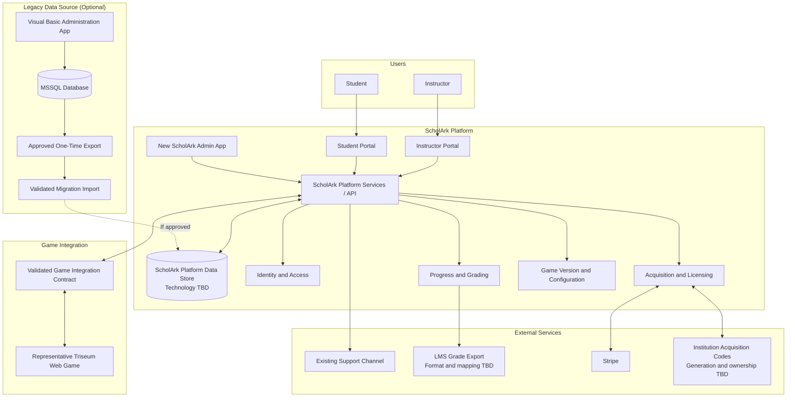

# ScholArk Target MVP Architecture

## Purpose

This diagram defines the planned product boundary. A new ScholArk Administration app will create and manage operational data alongside the Student and Instructor portals. The legacy Visual Basic application will not remain in operational use; selected data may be exported for a one-time migration if discovery confirms a need. Milestone 2 will select the features required for the initial minimum usable pilot.

## Context Diagram

## Target MVP Responsibilities

- Provide Student and Instructor portal experiences.
- Provide a new Admin app for the product's approved operational administration workflows.
- Authenticate and authorize portal users within their assigned context.
- Expose Admin-owned data to portals through a documented platform API/data contract.
- Manage or expose portal acquisition, launch, progress, grading, and configuration workflows according to the source-of-truth matrix established during discovery.
- Implement game-data mapping to ScholArk's generic record model and validate it with one representative Triseum-produced web game.
- Allow an authorized Instructor to initiate and download a classroom-scoped grade file in each LMS-oriented export format included in the finite target-MVP list baselined during discovery; later additions require explicit scope and forecast revision.
- Activate fixed-term licenses for exact immutable Game Versions through the approved acquisition paths; after expiry, a new acquisition creates a separate license. Enforce expiry and retain historical acquisition, license, game-play, and game-state records.
- Represent publisher-defined InstitutionGameOffers separately from institutions. An offer specifies designated payor, price, and license duration; a classroom assignment selects the offer and exact Game Version. Institutional billing is outside the MVP.
- Treat published classroom Game Version assignments and published GameCustomizations as immutable. Changes create replacement assignments or new customizations.

## Initial Pilot Boundary

- Deliver a working deployment for the Admin, Student, and Instructor workflows baselined during Milestone 2.
- Validate role-based access, the Admin-to-Portal contract, any approved legacy import, and one representative Triseum game integration or an agreed substitute.
- Treat target-MVP components outside the baselined pilot set as later roadmap work rather than automatic 2-3 month commitments.

## Representative Game Selection

ARTé: Mecenas v2.0 is selected as the representative game for integration validation. The legacy Admin record identifies the browser build as `http://arte-web.triseum.com/2.0.5/` and includes instructor and level-guide resources. Treat that URL as legacy reference data only: do not send launch credentials to it. Confirm a supported HTTPS launch endpoint and the game's authentication, configuration, event, and state contracts before wiring the build into ScholArk. The current ScholArk catalog seeds Mecenas 1.0.0, 1.4.0, and a demo against a separate launch URL; do not relabel those records as v2.0.

### Game Traffic Proxy Preference

Prefer serving the game through a ScholArk-controlled HTTPS URL that proxies requests to the selected Game Version's admin-managed `runUrl`, rather than redirecting the browser to the publisher URL. The current API prototype exchanges a short-lived, one-time launch ticket for an HttpOnly game session scoped to the authenticated user, license, and exact Game Version, then serves game content and `/api/v1/game/config`, `/api/v1/game/events`, and `/api/v1/game/state` through that origin. State-changing game API requests must match the configured game origin. Never accept a client-supplied upstream URL or forward ScholArk session credentials to the publisher origin. Production requires an HTTPS `GAME_PROXY_PUBLIC_ORIGIN` routed to the API; development may explicitly opt into the API's local origin when a dedicated game origin is unavailable. HTTP upstream access is disabled unless separately enabled; HTTP upstream traffic is unencrypted and modifiable between the API and game host. Publisher-domain verification and protections against internal-network destinations and unsafe DNS/redirect behavior are unresolved; see OQ-007. For Mecenas v2.0, verify asset/API paths, redirects, cookies, origin checks, and any non-HTTP transports; proxying is viable only if these work through the ScholArk origin or the game can be configured to do so. The legacy `http://arte-web.triseum.com/2.0.5/` URL is HTTP-only and must not be used for production launch. The application middleware is the current prototype boundary; it may move to an edge gateway after deployment and compatibility validation.

## New Admin App Responsibilities

- Create and manage institutions, publishers, instructors, courses, classrooms, and game listings.
- Maintain classroom, instructor, game-assignment, payment-mode, language, usage, and available configuration data required by the portals.
- Be the operational administration surface for the new platform; detailed workflows and pilot sequence are baselined in Milestone 2.

## Future Architecture

Future phases may add Support, Institution, and Game Publisher portals behind the same platform API and integration boundaries. Any approved legacy data migration is a one-time transition, not a continuing runtime dependency.

## Proposed Technology Direction

- Next.js and React with TypeScript for the Student and Instructor portals.
- NestJS on Node.js for the proposed Portal Services/API.
- A platform-owned data store selected for the new Admin and Portal requirements; legacy MSSQL is considered only as a possible one-time export source.
- A Turborepo monorepo managed with pnpm as the suggested code-organization option for applications, backend services, and shared packages, subject to Milestone 2 validation.
- Git for version control, following the client's repository hosting, branching, review, and release conventions.

Milestone 2 must validate this direction against the new product requirements, infrastructure, operational model, security constraints, and persistence decision before it becomes the implementation baseline.

## Decisions for Milestone 2

- Select the new platform's persistence architecture and Admin-to-Portal API/data boundary.
- Establish stable identifiers, data ownership, write permissions, API consistency, availability, and recovery expectations.
- Complete a source-of-truth matrix that identifies ownership and authority across Admin, Portal, and game data.
- Decide whether legacy data should be exported and imported; if so, define the dataset, mapping, validation, cutover, and rollback without adding ongoing synchronization.
- Produce the concrete domain model from the new product requirements and approved contracts; use legacy schema only to inform an approved migration.
- Define the minimum usable pilot acceptance set and its deployment environment.
- Define the Store catalog/discovery boundary and the Stripe checkout, webhook, idempotency, failure-handling, and fixed-term license activation flow.
- Define license duration, activation, expiry, fresh acquisition after expiry, status, and historical-retention rules, including in-progress session behavior at expiry. Licenses are not renewed.
- Define Game Version identity and release lifecycle. Publishers provide an unconstrained `publisherVersion` label; the target model licenses exact immutable Game Versions and classroom assignments select the permitted version. Discovery must define upgrade/replacement behavior and launch behavior for permitted versions.
- Define publisher ownership and publication of standalone and institution-use offers, and how institutions select institution-use offers through classroom assignments.
- Define the future Game Forge publication flow for data-only GameCustomizations, including content snapshots, draft/publication behavior, and compatibility with the selected Game Version. Capability and integration metadata remain open.
- Define institution acquisition-code generation, ownership, validation, and license activation behavior.
- Decide whether and how an existing not-for-credit Student Game and license can be associated with a classroom for credit, including license-term and duplicate-payment rules.
- Define how game-play and game-state records relate to a Student Game, and whether records created before a later classroom association are visible to the Instructor or eligible for classroom progress and grading.
- Select the LMS grade-export format(s) and define classroom/student mapping, Instructor authorization, and generation/download behavior.
- Validate the game event, game-state, configuration, and generic-record model against a representative Triseum game; select the maintainable mapping mechanism and any required onboarding/authoring tooling; and assign ownership of required game-side changes.
- Define version compatibility for game state, game-play structure, record mappings, progress, and grading, including migration, fallback, reset, and mixed-version history rules.
- Document versioned JSON schemas, transport, validation, retry, and error-handling contracts for game data.
- Establish expected users, institutions, games, event volumes, retention, and concurrency, then define measurable performance targets.
- Validate platform ownership of Student and Instructor identities and define Instructor linkage to imported records if legacy data migration is selected.
- Define active-game rules, grading depth, game-state ownership, and support-request routing.
