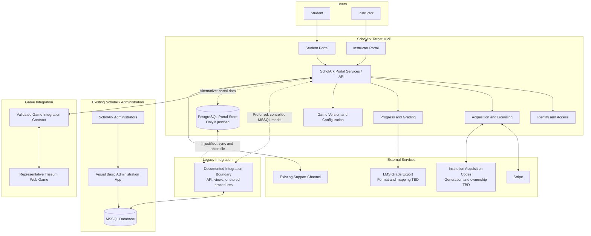

# ScholArk Target MVP Architecture

## Purpose

This diagram defines the proposed target-MVP boundary. ScholArk Administration is expected to continue creating and managing administrative data in the existing Visual Basic application and MSSQL database, subject to validation during discovery. The target MVP adds a modern integration and portal layer for Student and Instructor workflows without replacing the administration application. Milestone 2 will select the subset required for the initial minimum usable pilot.

## Context Diagram

## Target MVP Responsibilities

- Provide Student and Instructor portal experiences.
- Authenticate and authorize portal users within their assigned context.
- Consume approved administrative data through a documented integration boundary.
- Manage or expose portal acquisition, launch, progress, grading, and configuration workflows according to the source-of-truth matrix established during discovery.
- Implement game-data mapping to ScholArk's generic record model and validate it with one representative Triseum-produced web game.
- Allow an authorized Instructor to initiate and download a classroom-scoped grade file in each LMS-oriented export format included in the finite target-MVP list baselined during discovery; later additions require explicit scope and forecast revision.
- Activate and renew fixed-term licenses for exact immutable Game Versions through the approved acquisition paths, enforce expiry for game access, and retain historical acquisition, license, game-play, and game-state records.
- Represent institutional contracts separately from classroom game assignments. Contracts determine which games an institution may assign; assignments select a Game Version, active period, license duration, and payment arrangement.
- Treat published classroom Game Version assignments and published customized Game Versions as immutable. Changes create replacement assignments or new versions.
- Separate catalog visibility from classroom availability: publicly available base Game Versions may be listed in the general catalog, while classroom-associated Game Versions are excluded from catalog discovery and exposed only through their ClassroomGame assignment.

## Initial Pilot Boundary

- Deliver a working frontend/backend deployment for the Student and Instructor workflows baselined during Milestone 2.
- Validate role-based access, the legacy integration boundary, and one representative Triseum game integration or an agreed substitute.
- Treat target-MVP components outside the baselined pilot set as later roadmap work rather than automatic 2-3 month commitments.

## Expected Existing Application Responsibilities

- Create and manage institutions, publishers, instructors, courses, classrooms, and game listings.
- Maintain classroom, instructor, game-assignment, payment-mode, language, usage, and available configuration data required by the portals.
- Be expected to remain operational throughout MVP pilot and production rollout, subject to validation during discovery.

## Future Architecture

Future phases may add Administration, Support, Institution, and Game Publisher portals behind the same portal API and integration boundaries. Replacement or modernization of the existing Visual Basic application requires a separately approved scope and transition plan.

## Proposed Technology Direction

- Next.js and React with TypeScript for the Student and Instructor portals.
- NestJS on Node.js for the proposed Portal Services/API.
- MSSQL as the preferred single database, using platform-specific schemas/tables and stable views, stored procedures, or an API rather than assuming direct reuse of legacy tables. PostgreSQL remains an option only if discovery justifies synchronization.
- A Turborepo monorepo managed with pnpm as the suggested code-organization option for applications, backend services, and shared packages, subject to Milestone 2 validation.
- Git for version control, following the client's repository hosting, branching, review, and release conventions.

Milestone 2 must validate this direction against the existing implementation, infrastructure, operational model, security constraints, and database-integration decision before it becomes the implementation baseline.

## Decisions for Milestone 2

- Validate the preferred single-MSSQL architecture against the existing code, schema, infrastructure, and operations. It may use new platform-specific schemas/tables and stable views, stored procedures, or an API; it does not require direct legacy-table reuse. Select synchronized PostgreSQL or a limited hybrid only when discovery demonstrates material advantages that justify the added consistency and operational burden, and document the evidence, tradeoffs, and transition path.
- Establish stable identifiers, data ownership, write permissions, consistency and latency expectations, conflict handling, synchronization, reconciliation, monitoring, and recovery.
- Complete a source-of-truth matrix that identifies ownership and authority for overlapping legacy, portal, and game data.
- Produce the concrete domain model after validating the initial model against the existing MSSQL schema, workflows, integration contracts, and selected persistence architecture.
- Define the minimum usable pilot acceptance set and its deployment environment.
- If PostgreSQL synchronization is selected, define direction, triggering or frequency, initial backfill, change detection, idempotency, deletion handling, conflict policy, reconciliation, monitoring, retry and recovery, and acceptable staleness.
- Define the Store catalog/discovery boundary and the Stripe checkout, webhook, idempotency, failure-handling, and fixed-term license activation flow.
- Define catalog visibility rules for public base Game Versions versus classroom-only Game Versions, including the ClassroomGame page used to expose classroom-associated versions.
- Define license duration, activation, expiry, renewal, grace-period, status, and historical-retention rules, including in-progress session behavior at expiry.
- Define Game Version identity and release lifecycle. The target model licenses exact immutable Game Versions and classroom assignments select the permitted version; discovery must define upgrade/replacement behavior and launch behavior for permitted versions.
- Define institutional contract structure, contract-to-game eligibility, contract periods, and how contract changes affect existing classroom assignments.
- Define the future Game Forge publication flow for customized Game Versions, including content snapshots, enabled languages/locales, global identifiers, and optional source-version lineage.
- Define institution acquisition-code generation, ownership, validation, license activation, and renewal behavior.
- Decide whether and how an existing not-for-credit Student Game and license can be associated with a classroom for credit, including license-term and duplicate-payment rules.
- Define how game-play and game-state records relate to a Student Game, and whether records created before a later classroom association are visible to the Instructor or eligible for classroom progress and grading.
- Select the LMS grade-export format(s) and define classroom/student mapping, Instructor authorization, and generation/download behavior.
- Validate the game event, game-state, configuration, and generic-record model against a representative Triseum game; select the maintainable mapping mechanism and any required onboarding/authoring tooling; and assign ownership of required game-side changes.
- Define version compatibility for game state, game-play structure, record mappings, progress, and grading, including migration, fallback, reset, and mixed-version history rules.
- Document versioned JSON schemas, transport, validation, retry, and error-handling contracts for game data.
- Establish expected users, institutions, games, event volumes, retention, and concurrency, then define measurable performance targets.
- Validate portal ownership of Student and Instructor identities and linkage to legacy Instructor records.
- Define active-game rules, grading depth, game-state ownership, and support-request routing.
