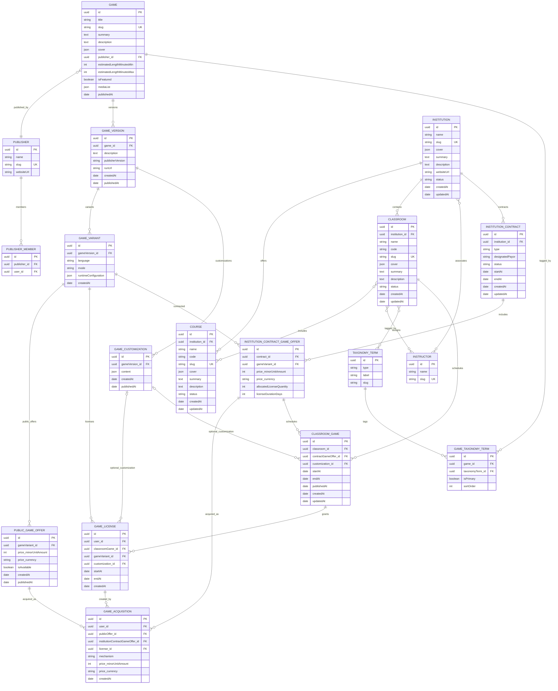

# Current Model ER Diagram

Account and identity entities are excluded. `GameLicense.user` and `GameAcquisition.user` reference the excluded `User` entity.



## Constraints

- `Game.slug` unique.
- `GameVersion(game, publisherVersion)` unique.
- `GameVariant(gameVersion, language, mode)` unique.
- `Institution.slug` unique.
- `Course.slug` unique.
- `Course(institution, code)` unique.
- `Classroom.slug` unique.
- `Classroom(institution, code)` unique.
- `Instructor.slug` unique.
- `TaxonomyTerm(type, slug)` unique.
- `GameTaxonomyTerm(gameId, taxonomyTerm)` unique.
- `InstitutionContractGameOffer(contract, gameVariant)` unique.
- `GameLicense(user, classroomGame)` unique for classroom licenses; public licenses leave `classroomGame` null.

## Value Types

```text
Media = { type: image | video, src: string, alt: string }
Money = { minorUnitAmount: integer, currency: Currency }
```

`Media` is stored as JSON. `Money` is embedded with `price_` prefixes in `PublicGameOffer`, `InstitutionContractGameOffer`, `GameAcquisition`, and payment attempts. Public offers are optional; a listed game version can have institutional offers without a public offer.
